# Hi there, I'm Jayanth Bheemudi! 👋

  

I'm a Software Engineer and Machine Learning Enthusiast based in Hyderabad, India. Currently pursuing my Bachelor of Engineering in Information Technology at Chaitanya Bharathi Institute of Technology (CBIT). I enjoy building high-throughput real-time systems, full-stack web applications, and intelligent ML/DL workflows.

---

### 🚀 What I Do
- 🛠️ **Backend & Systems**: Design and develop low-latency web backends, WebSockets interfaces, and microservices.
- 📊 **Data Engineering**: Construct real-time stream processing pipelines capable of processing thousands of events per second.
- 🧠 **Machine Learning**: Research and build hybrid ML/DL classification architectures, Convolutional Neural Networks (CNNs), and analytics dashboards.

---

### 💻 Tech Stack & Tools

| Category | Technologies |
| :--- | :--- |
| **Languages** |       |
| **Frameworks & Libs** |        |
| **Data & Messaging** |   |
| **Tools & Platforms** |    |

---

### 📂 Featured Projects

#### 1. 🏎️ Real-Time Geospatial Ride Demand & Surge Pricing Engine
*PySpark, FastAPI, Leaflet.js, WebSockets*
- Built a high-velocity streaming pipeline utilizing Apache Spark Structured Streaming to ingest and process **50,000+ geospatial events/sec** (ride requests & driver telemetry) with end-to-end latency of **<200ms**.
- Created a dynamic hotspot detection algorithm with **10-second tumbling windows** mapping coordinate grids to supply-demand balances.
- Programmed a dynamic pricing engine triggering multipliers (**1.0x–3.5x**) in real time, serving calculations through FastAPI WebSockets with **p99 response times <15ms**.

#### 2. 🏥 Healthcare Disease Prediction System
*Python, Flask, CNN, Random Forest, HTML/CSS, JS*
- Constructed a hybrid ML/DL classification model combining Random Forests and CNNs to diagnose patients based on symptom lists and medical images, hitting **94% accuracy**.
- Created a secure Flask web portal handling patient history encryption for **500+ simulated records**, decreasing response latency by **~40%**.
- Integrated automated PDF diagnostics reporting delivering results, confidence ratings, and prescriptions in **under 3 seconds**.

#### 3. 🛡️ Cyber Threat Detector
*React.js, Node.js, Express, VirusTotal API*
- Programmed a full-stack scanner assessing links, files, and domains for potential malware threats.
- Integrated **VirusTotal API** endpoints for live scanning feedback and detailed vulnerability logs.
- Engineered a safe sandbox file upload structure with backend validation checking file headers to block malicious injections.

---

### 🏆 Certifications
- **MongoDB Certified Associate Developer** – Python Focus
- **Oracle Certified Foundations Associate**
- **NPTEL** – Google Cloud Computing

---

### 🤝 Let's Connect!
- 📧 **Email**: [jayanthreddybunny@gmail.com](mailto:jayanthreddybunny@gmail.com)
- 💼 **LinkedIn**: [linkedin.com/in/jayanth-bheemudi](https://linkedin.com/in/jayanth-bheemudi)
- 🌐 **Portfolio**: *Check out my live portfolio in this repository!*

---

  <i>"Writing clean, performant, and scale-ready code."</i>

